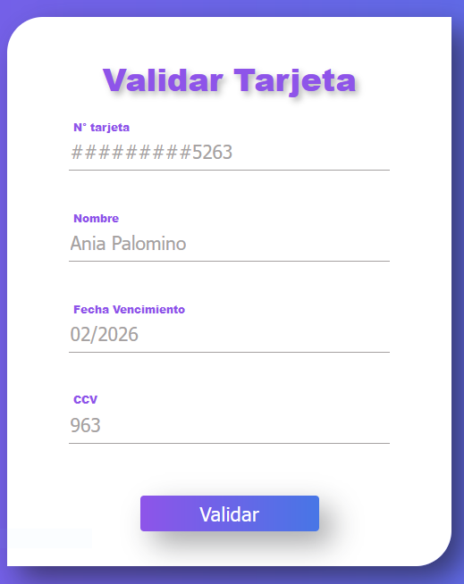

# Validación de tarjeta de Credito

## Índice

- [1. Objetivos ](#1-objetivos)
- [2. Usuarios ](#2-usuarios)
- [3. Solución](#3-Solucion)
- [4. Manual](#4-Manual)
- [5. Aprendizaje y herremientas de apoyo](#5-aprendizajes-y-herramientas-de-apoyo)

---

## 1. Objetivo 

Este proyecto esta pensado para dar solución y válidez de cualquier tarjeta de credito aplicando [algoritmo de Luhn](https://es.wikipedia.org/wiki/Algoritmo_de_Luhn) ,también llamado algoritmo de módulo 10, es un método de suma de verificación,
se utiliza para validar números de identificación; tales como el IMEI de los
celulares, tarjetas de crédito, etc.

esta pensado para satisfacer las necesidades de las personas que desean hacer una transaccion bancaria desde la comodida de su hogar , trabajo , calle,etc.
verificar antes de usar una tarjeta.

---

## 2. usuarios 

- Pensado para usuarios que desean hacer una transaccion bancaria desde la comodida de su hogar , trabajo , calle,etc.Con la seguridad de que sus datos son lo correcto para ambas partes(demadante y ofertante).Verificar antes de usar una tarjeta.
- Los pagos en las tiendas de servicio o alimentos que tengan una tienda online.

---

## 3. Solucion 

- La principal solución es tener solo tarjetas validadas,para hacer operaciones bancarias o compras online de manera segura.
  en ese sentido tenemos una de las posibles soluciones a la vulnerabilidad de la tarjeta de compras o creditos.

---

## 4. Manual

- [Mi-prototito](https://www.figma.com/proto/QYHE0sz1P1WbB6VMeGMFoK/Untitled?node-id=0%3A1&scaling=scale-down&page-id=0%3A1&starting-point-node-id=39%3A23)
- Pasos :

# 1

Ingresar a la siguiente direccion [Click](https://aniapalominoq.github.io/DEV001-card-validation/) .

# 2

Se muestra el siguiente formulario.

# 3

completar con todos los campos solicitados como muestra la siguiente imagen y pulsar en el boton <button style="  background: linear-gradient(to left, #4776e6, #8e54e9);
  width: 100px;
  height: 20px;
  border: none;
  color: #fff;
  border-radius: 4px;
">Validar</button> .

# 4

En la siguiente imagen se muestra como sale la respuesta de la validez de la tarjeta.

## 

## 5. Aprendizajes y herramientas de apoyo

Reflexiona y luego marca los objetivos que ha llegado a entender y aplicar en tu proyecto. Piensa en eso al decidir tu estrategia de trabajo.

### HTML

- [ ] **Uso de HTML semántico**

  <detalles>
Enlaces

  - [ HTML semántico ](https://curriculum.laboratoria.la/es/topics/html/02-html5/02-semantic-html)
  - [ Semántica - Glosario de documentos web de MDN ](https://developer.mozilla.org/en-US/docs/Glossary/Semantics#Semantics_in_HTML)
  
</detalles>

### CSS

- [ ] **Uso de selectores de CSS**

  <detalles>
Enlaces

  - [ Introducción a CSS ](https://curriculum.laboratoria.la/es/topics/css/01-css/01-intro-css)
  - [ Selectores CSS - MDN ](https://developer.mozilla.org/es/docs/Web/CSS/CSS_Selectors)
  
</detalles>

- [ ] **Modelo de caja: borde, margen, padding**

  <detalles>
Enlaces

  - [ Box Model & Display ](https://curriculum.laboratoria.la/es/topics/css/01-css/02-boxmodel-and-display)
  - [ El modelo de caja - MDN ](https://developer.mozilla.org/en-US/docs/Learn/CSS/Building_blocks/The_box_model)
  - [ Introducción al modelo de caja CSS - MDN ](https://developer.mozilla.org/en-US/docs/Web/CSS/CSS_Box_Model/Introduction_to_the_CSS_box_model)
  - [ Pantalla CSS - MDN ](https://developer.mozilla.org/pt-BR/docs/Web/CSS/display)
  - [ mostrar - Trucos CSS ](https://css-tricks.com/almanac/properties/d/display/)
  
</detalles>

### API web

- [ ] **Uso de selectores del DOM**

  <detalles>
Enlaces

  - [ Manipulación del DOM ](https://curriculum.laboratoria.la/es/topics/browser/02-dom/03-1-dom-methods-selection)
  - [ Introducción al DOM - MDN ](https://developer.mozilla.org/es/docs/Web/API/Document_Object_Model/Introduction)
  - [ Localizando elementos DOM usando selectores - MDN ](https://developer.mozilla.org/es/docs/Web/API/Document_object_model/Locating_DOM_elements_using_selectors)
  
</detalles>

- [ ] **Manejo de eventos del DOM (oyentes, propagación, delegación)**

  <detalles>
Enlaces

  - [ Introducción a eventos - MDN ](https://developer.mozilla.org/es/docs/Learn/JavaScript/Building_blocks/Events)
  - [ EventTarget.addEventListener() - MDN ](https://developer.mozilla.org/es/docs/Web/API/EventTarget/addEventListener)
  - [ EventTarget.removeEventListener() - MDN ](https://developer.mozilla.org/es/docs/Web/API/EventTarget/removeEventListener)
  - [ El objeto Evento ](https://developer.mozilla.org/es/docs/Web/API/Event)
  
</detalles>

- [ ] **Manipulación dinámica del DOM**

  <detalles>
Enlaces

  - [ Introducción al DOM ](https://developer.mozilla.org/es/docs/Web/API/Document_Object_Model/Introduction)
  - [ Nodo.appendChild() - MDN ](https://developer.mozilla.org/es/docs/Web/API/Node/appendChild)
  - [ Documento.createElement() - MDN ](https://developer.mozilla.org/es/docs/Web/API/Document/createElement)
  - [ Documento.createTextNode() ](https://developer.mozilla.org/es/docs/Web/API/Document/createTextNode)
  - [ Element.innerHTML - MDN ](https://developer.mozilla.org/es/docs/Web/API/Element/innerHTML)
  - [ Node.textContent - MDN ](https://developer.mozilla.org/es/docs/Web/API/Node/textContent)
  
</detalles>

### Javascript

- [ ] **Tipos de datos primitivos**

  <detalles>
Enlaces

  - [ Valores primitivos - MDN ](https://developer.mozilla.org/es/docs/Web/JavaScript/Data_structures#valores_primitivos)
  
</detalles>

- [ ] **Cadenas (cadenas de caracteres)**

  <detalles>
Enlaces

  - [ Cadenas ](https://curriculum.laboratoria.la/es/topics/javascript/06-strings)
  - [ String — Cadena de caracteres - MDN ](https://developer.mozilla.org/es/docs/Web/JavaScript/Reference/Global_Objects/String)
  
</detalles>

- [ ] **Variables (declaración, protección, ámbito)**

  <detalles>
Enlaces

  - [ Valores, tipos de datos y operadores ](https://curriculum.laboratoria.la/es/topics/javascript/01-basics/01-values-variables-and-types)
  - [ Variables ](https://curriculum.laboratoria.la/es/topics/javascript/01-basics/02-variables)
  
</detalles>

- [ ] **Uso de condicionales (if-else, switch, operador ternario, lógica booleana)**

  <detalles>
Enlaces

  - [ Estructuras condicionales y repetitivas ](https://curriculum.laboratoria.la/es/topics/javascript/02-flow-control/01-conditionals-and-loops)
  - [ Tomando decisiones en tu código — condicionales - MDN ](https://developer.mozilla.org/es/docs/Learn/JavaScript/Building_blocks/conditionals)
  
</detalles>

- [ ] **Uso de bucles/ciclos (while, for, for..of)**

  <detalles>
Enlaces

  - [ Bucles (Loops) ](https://curriculum.laboratoria.la/es/topics/javascript/02-flow-control/02-loops)
  - [ Bucles e iteración - MDN ](https://developer.mozilla.org/es/docs/Web/JavaScript/Guide/Loops_and_iteration)
  
</detalles>

- [ ] **Funciones (params, args, return)**

  <detalles>
Enlaces

  - [ Funciones (control de flujo) ](https://curriculum.laboratoria.la/es/topics/javascript/02-flow-control/03-functions)
  - [ Funciones clásicas ](https://curriculum.laboratoria.la/es/topics/javascript/03-functions/01-classic)
  - [ Funciones Flecha ](https://curriculum.laboratoria.la/es/topics/javascript/03-functions/02-arrow)
  - [ Funciones — bloques de código reutilizables - MDN ](https://developer.mozilla.org/es/docs/Learn/JavaScript/Building_blocks/Functions)
  
</detalles>

- [ ] **Pruebas unitarias (pruebas unitarias)**

  <detalles>
Enlaces

  - [ Empezando con Jest - Documentación oficial ](https://jestjs.io/docs/es-ES/getting-started)
  
</detalles>

- [ ] **Módulos de ECMAScript (Módulos ES)**

  <detalles>
Enlaces

  - [ importar - MDN ](https://developer.mozilla.org/es/docs/Web/JavaScript/Reference/Statements/import)
  - [ exportar - MDN ](https://developer.mozilla.org/es/docs/Web/JavaScript/Reference/Statements/export)
  
</detalles>

- [ ] **Uso de linter (ESLINT)**

- [ ] **Uso de identificadores descriptivos (Nomenclatura y Semántica)**

### Control de Versiones (Git y GitHub)

- [ ] **Git: Instalación y configuración**

- [ ] **Git: Control de versiones con git (init, clone, add, commit, status, push, pull, remote)**

- [ ] **GitHub: Creación de cuenta y repositorios, configuración de claves SSH**

- [ ] **GitHub: Despliegue con GitHub Pages**

  <detalles>
Enlaces

  - [ Sitio oficial de GitHub Pages ](https://pages.github.com/)
  
</detalles>

### Centrado en el usuario

- [ ] **Diseñar y desarrollar un producto o servicio poniendo a las usuarias en el centro**

### Diseño de producto

- [ ] **Crear prototipos de alta fidelidad que incluyan interacciones**

- [ ] **Seguir los principios básicos de diseño visual**

---

### Recursos y temas relacionados

Súmate al canal de Slack [ #project-card-validation ](https://claseslaboratoria.slack.com/archives/C03LXJ10WJD) para conversar y pedir ayuda de proyecto.

A continuación un video de Michelle que te lleva a través del algoritmo de Luhn
y un par de cosas más que debes saber para resolver este proyecto. ¡Escúchala
con detenimiento y sigue sus consejos! :)

[ Enlace ](https://www.youtube.com/watch?v=f0zL6Ot9y_w)

Terminal y shell de UNIX:

[ Enlace ](https://www.youtube.com/playlist?list=PLiAEe0-R7u8nGH5TEHfSTeDNIvjZFe_Yd)

Control de versiones y trabajo colaborativo con Git y GitHub:

[ Enlace ](https://www.youtube.com/playlist?list=PLiAEe0-R7u8k9o3PbT3_QdyoBW_RX8rnV)

Desarrollo Frontend:

- [ Documentación de NPM ](https://docs.npmjs.com/)

Organización del Trabajo:

- [ Metodologías Ágiles ](https://www.youtube.com/watch?v=v3fLx7VHxGM)
- [ Scrum en menos de 2 minutos ](https://www.youtube.com/watch?v=TRcReyRYIMg)
- [ Scrum en Detalle ](https://www.youtube.com/watch?v=nOlwF3HRrAY&t=297s). No
  Esperamos que hagas todo eso desde este proyecto. Iremos profundizando poco a
  poco a lo largo del - _bootcamp_ .
- [ Blog: cómo funciona el algoritmo de Luhn ](http://www.quobit.mx/asi-funciona-el-algoritmo-de-luhn-para-generar-numeros-de-tarjetas-de-credito.html) .
